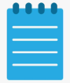
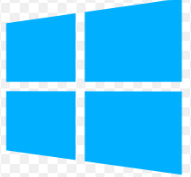

    <!-- Example Desktop Icon -->
    

        
        
My Documents

    

    

        
        
Notepad

    

    

        
    

    

    <ul>
        <li>Notepad</li>
        <li>Calculator</li>
        <li>Settings</li>
    </ul>

